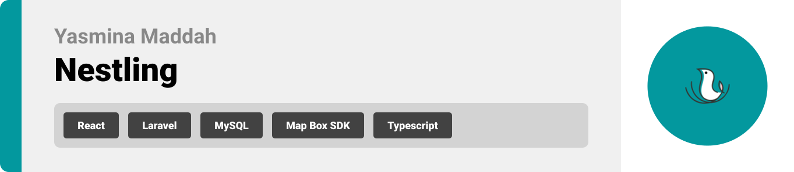
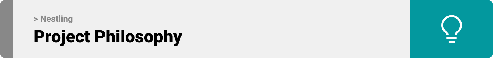
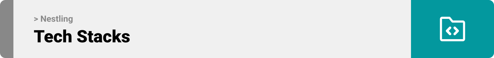
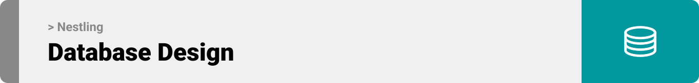
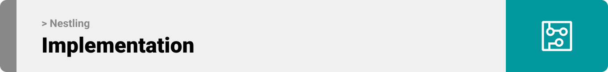
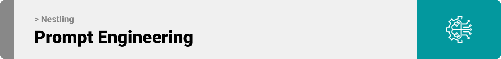
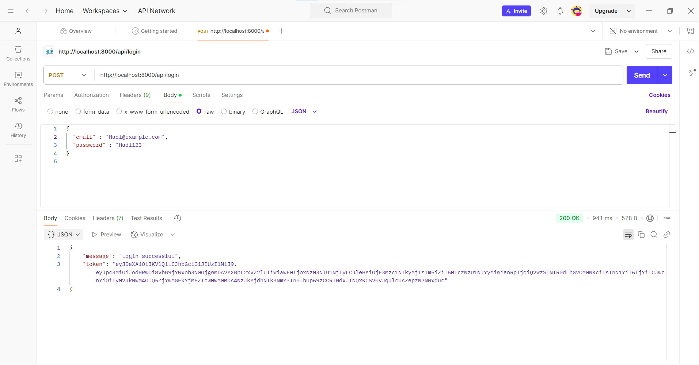
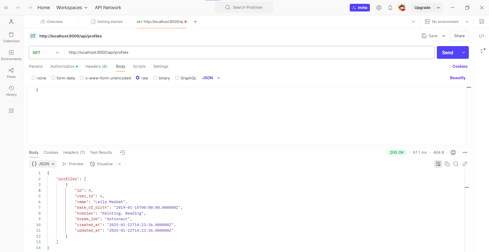
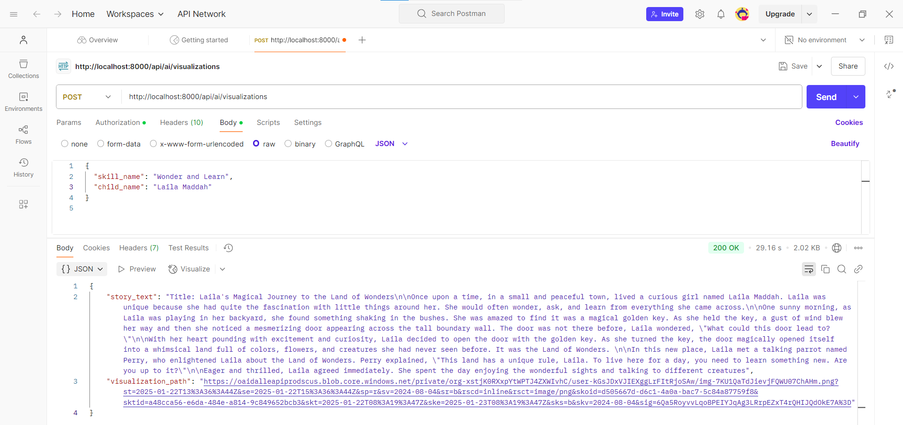
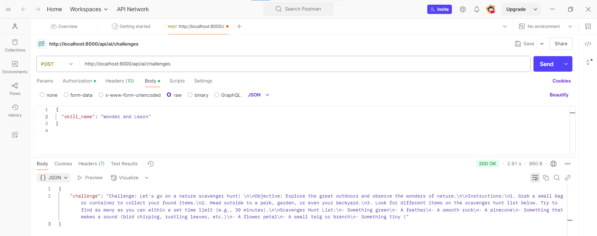

<br><br>

<!-- project philosophy -->


> Nestling is an innovative platform that empowers parents to support their children’s development through AI-driven tools like story visualizations, skill tracking, and personalized recommendations. Parents can create profiles, monitor progress, and explore curated resources to nurture essential skills. 
>
> With its engaging and customized learning experiences, Nestling transforms everyday moments into meaningful growth opportunities. It’s a comprehensive solution for fostering creativity, critical thinking, and lifelong learning in an enjoyable way. Nestling redefines how parents and children connect through education, offering a forward-thinking vision for personalized learning.

### User Stories

#### User 👨‍👩‍👧
- As a user, I want to create profiles for my children, including their names, ages, and interests, so that I can track their development and personalize their learning experience.
- As a user, I want to select specific skills I want my children to develop from a predefined list so that I can focus on areas that are important to their growth.
- As a user, I want to view detailed reports on my child’s skill development based on their activities on the platform so that I can better understand their learning journey.
- As a user, I want to explore with my children games so they can develope their skills in a fun, interactive way.

#### Admin 👩🏽‍💼
- As an administrator, I want to add, edit, or remove recommended resources so that parents always have access to high-quality content.
- As an administrator, I want to monitor user activity and engagement metrics so that I can identify opportunities for platform improvement.

<br><br>
<!-- Tech stack -->


###  Nestling is built using the following technologies:

- This project uses the [React](https://react.dev/). React is a JavaScript library for building user interfaces, especially single-page applications. It allows developers to create reusable UI components, manage state efficiently, and update the DOM dynamically for a seamless user experience.
- For persistent storage (database), the app uses the [MySQL](https://www.mysql.com/). The project utilizes MySQL as the database to ensure efficient data storage, management, and retrieval.
- The project uses [Laravel](https://laravel.com/), a PHP framework known for its elegant syntax and robust features, to streamline backend development. Its importance lies in providing tools for efficient routing, authentication, and database management, making development faster and more secure.
- [JWT](https://jwt.io/) is utilized for authentication and session management.
- The chatbot is powered by [OpenAI GPT-4](https://openai.com/), with the integration managed through the Node.js service.


<br><br>
<!-- UI UX -->


> We designed Nestling using wireframes and mockups, iterating on the design until we reached the ideal layout for easy navigation and a seamless user experience.

- Project Figma design [figma](https://www.figma.com/design/Z7pWDba1dT9sRDpovOTpKh/Untitled?node-id=0-1&t=O4S6QaouQqIm8dcP-1)


### Mockups
| Landing screen  | SignUp/Login Screens | 
| ---| ---| 
| .png) | <br>| 

| Dashboard Screen | Profile screen |
| ---| ---| 
| .png) |  |

| Skill Suggestion screen | AI screen |
| ---| ---| 
|  | .png) |
<!-- Database Design -->


###  Architecting Data Excellence: Innovative Database Design Strategies:

- Insert ER Diagram here


<br><br>


<!-- Implementation -->



### User Screens (Mobile)
| Login screen  | Register screen | Landing screen | Loading screen |
| ---| ---| ---| ---|
|  |  |  |  |
| Home screen  | Menu Screen | Order Screen | Checkout Screen |
|  |  |  |  |

### Admin Screens (Web)
| Login screen  | Register screen |  Landing screen |
| ---| ---| ---|
|  |  |  |
| Home screen  | Menu Screen | Order Screen |
|  |  |  |

<br><br>


<!-- Prompt Engineering -->


###  Mastering AI Interaction: Unveiling the Power of Prompt Engineering:

- This project uses advanced prompt engineering techniques to optimize the interaction with natural language processing models. By skillfully crafting input instructions, we tailor the behavior of the models to achieve precise and efficient language understanding and generation for various tasks and preferences.

<br><br>

<!-- AWS Deployment -->


###  Efficient AI Deployment: Unleashing the Potential with AWS Integration:

- This project leverages AWS deployment strategies to seamlessly integrate and deploy natural language processing models. With a focus on scalability, reliability, and performance, we ensure that AI applications powered by these models deliver robust and responsive solutions for diverse use cases.

- API Documentation: Detailed API documentation can be accessed through Postman.

- Website URL: Visit our live website at .

| Login API  | GET Children Profiles API | 
| ---| ---| 
|  |  | 

| POST AI Visualization API | POST Challenegs API |
| ---| ---| 
|  |  | 

<br><br>

<!-- How to run -->


> To set up Nestling locally, follow these steps:

### Prerequisites

This is an example of how to list things you need to use the software and how to install them.
* npm
  ```sh
  npm install npm@latest -g
  ```

### Installation

_Below is an example of how you can instruct your audience on installing and setting up your app. This template doesn't rely on any external dependencies or services._

1. Clone the repo
   git clone [github](https://github.com/Yasmina-Maddah/Nestling.git)
2. cd <Nestling>
3. Setup the Backend(Laravel)
- Install PHP & Composer
Ensure PHP (v8.0 or higher) and Composer are installed. Use these commands to check:
```sh
    php -v
    composer -v
 ```
  If not installed, download: 
 -PHP
 -Composer

 - Install Laravel Dependencies
 Navigate to the backend directory 
```sh
    cd backnd
```
 - Install dependencies
```sh
    composer install
```
- Copy the .env.example file to .env
```sh
    cp .env.example .env
```
- Update the .env file with your database configuration
```sh
    DB_CONNECTION=mysql
    DB_HOST=127.0.0.1
    DB_PORT=3306
    DB_DATABASE=nestling_db
    DB_USERNAME=root
    DB_PASSWORD=
```
- Open phpMyAdmin (http://localhost/phpmyadmin)
- Create a new database named nestling_db
- Run migrations
```sh
    php artisan migrate
```
- Run the Laravel server
```sh
    php artisan serve
```
4. Set Up the Frontend (React)
- Navigate to the frontend folder:
```sh
    cd frontend
```
- Install Node.js dependencies:
```sh
    npm install
```
- Start the React development server:
```sh
    npm start
```
Now, you should be able to run Nestling locally and explore its features.